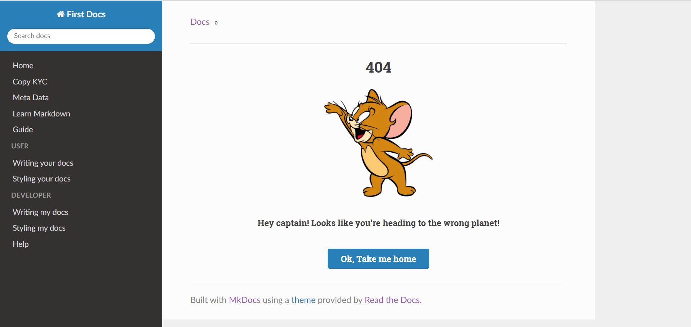

# Build project docs with MkDocs

- Learn & Build project documents with [MkDocs](https://www.mkdocs.org/) 

- Visit my docs if you're too free (: [First Docs](https://laithoura.github.io/learn-mkdocs/)  

  

## Prerequisite
- [Download Python](https://www.python.org/)
- [Install Python Guide](https://www.mkdocs.org/user-guide/installation/)
- [Install MkDocs Guide](https://www.mkdocs.org/getting-started/)

## Installation:
1. `git@github.com:laithoura/learn-mkdocs.git` - clone the project to your local
2. `cd learn-mkdocs` - go to root project
3. `mkdocs serve` -  Start the live-reloading docs server
4. `mkdocs build` - Build the documentation site
5. `mkdocs gh-deploy` - build & push your project docs into gh-pages branch and deploy it to [GitHub Pages](https://pages.github.com/).

## Configuration
#### I. DEV
- Before we deploy the project on local or [GitHub Pages](https://pages.github.com/), we need to change below configuration accordingly.
1. Configure Site URL:
    - open `mkdocs.yml`
      ```
      site_url: http://127.0.0.1:8000/
      ```
2. Configure Custom Resources Relative Path  
- We created a custom page 404 page, so we need to adjust the resource path accordingly on **Local** & **Live** server.
    - open `custom_theme/404.html`  
    - Line 11:
      ```
      
      ```
    - Line 22:
      ```
      <a style="color: #fff;" href="/">Ok, Take me home</a> 
      ```

#### II. PRD (Host on [Github Pages](https://pages.github.com/)):
    
- Before we deploy the project on local or [GitHub Pages](https://pages.github.com/), we need to change below configuration
1. Configure Site URL:
    - open `mkdocs.yml`
      ```
      site_url: https://laithoura.github.io/learn-mkdocs/
      ```
2. Configure Custom Resources Relative Path
- We created a custom page 404 page, so we need to adjust the resource path accordingly on **Local** & **Live** server.
    - open `custom_theme/404.html`
    - Line 11:
      ```
      
      ```
    - Line 22:
      ```
      <a style="color: #fff;" href="/learn-mkdocs">Ok, Take me home</a> 
      ```