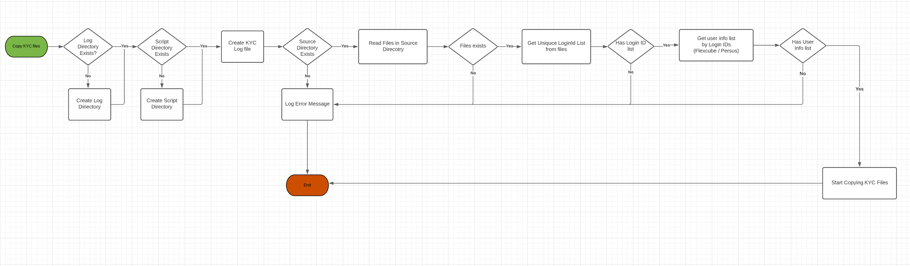
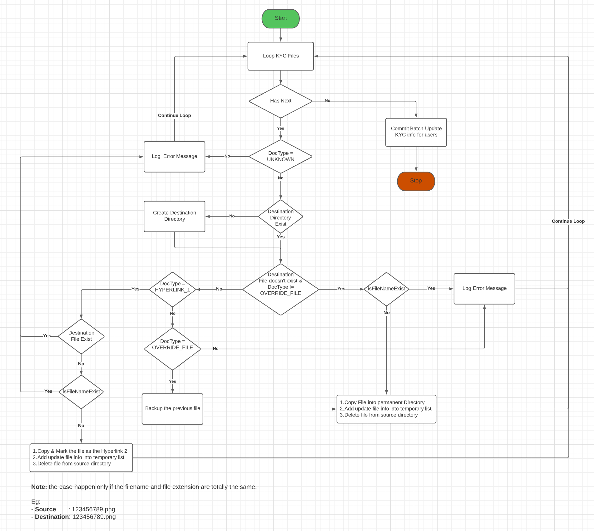

# Copy KYC Hyperlink Files

It is a Java desktop application. We normally set a scheduled job on server to trigger the application to run every midnight.  
The application will copy the KYC files of Perseus/Flexcube accounts from a temporary directory into a permanent directory.

## Copy KYC Files Flowchart

